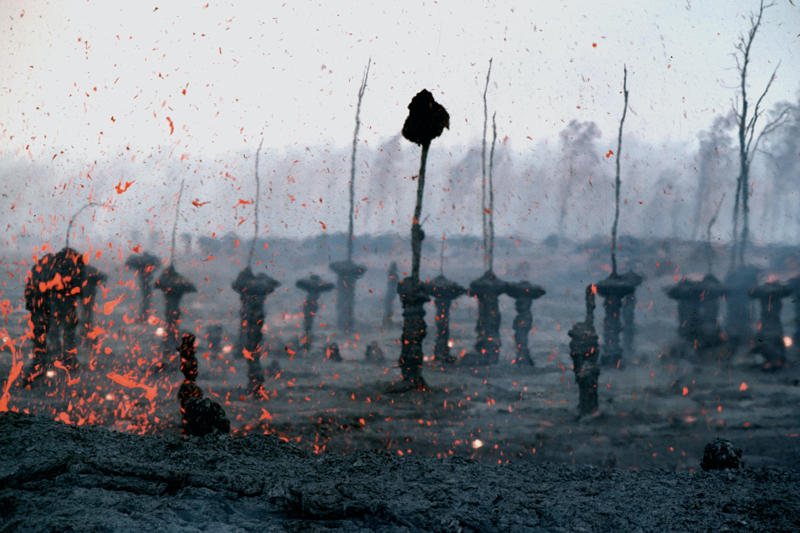
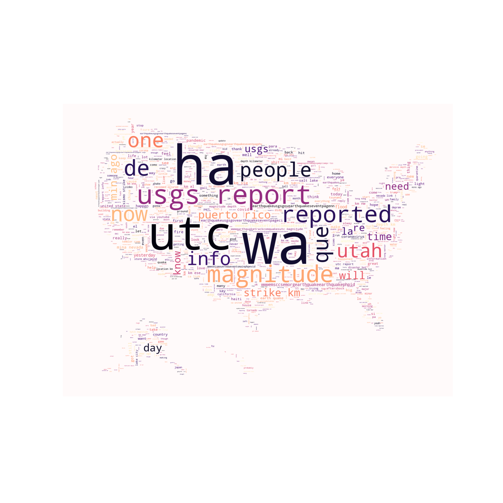
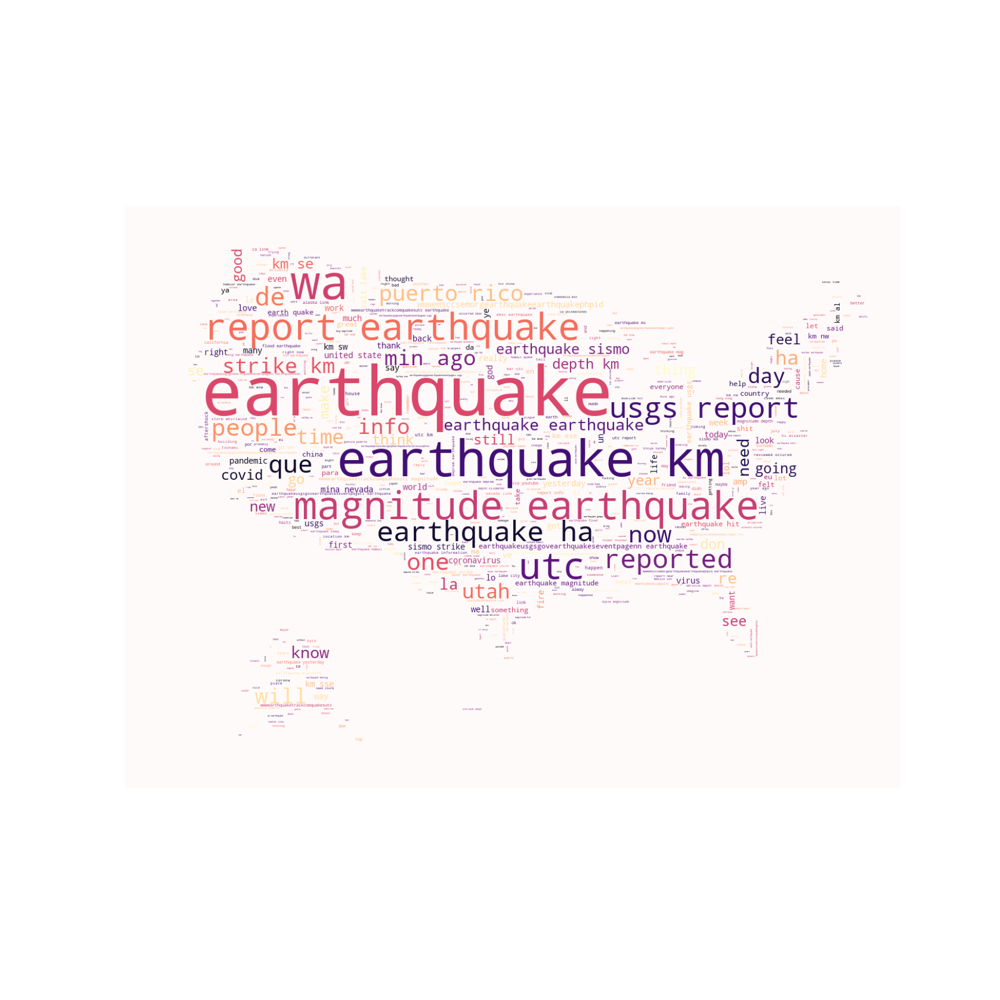
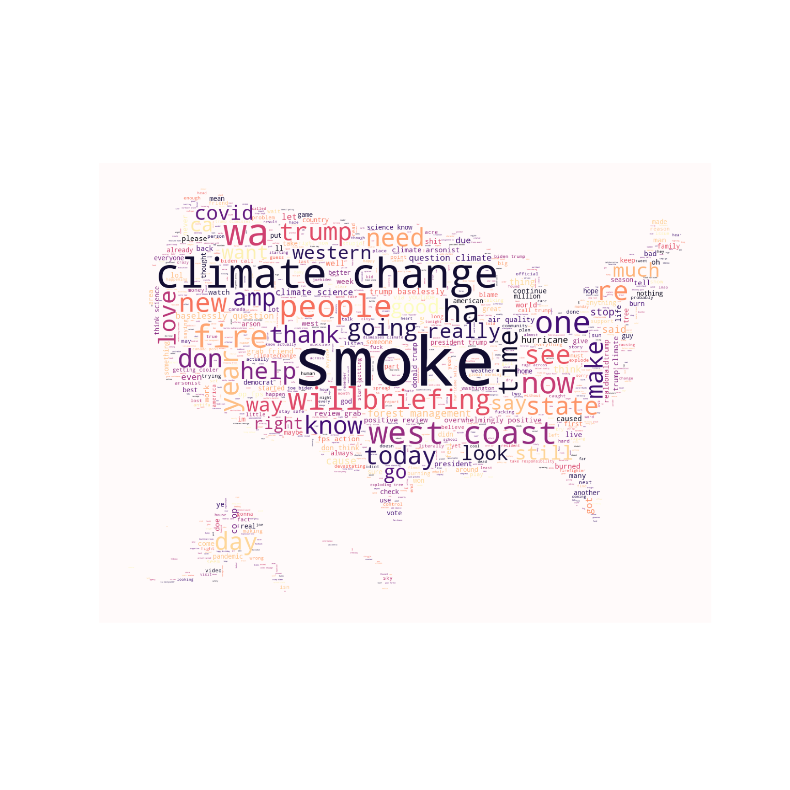
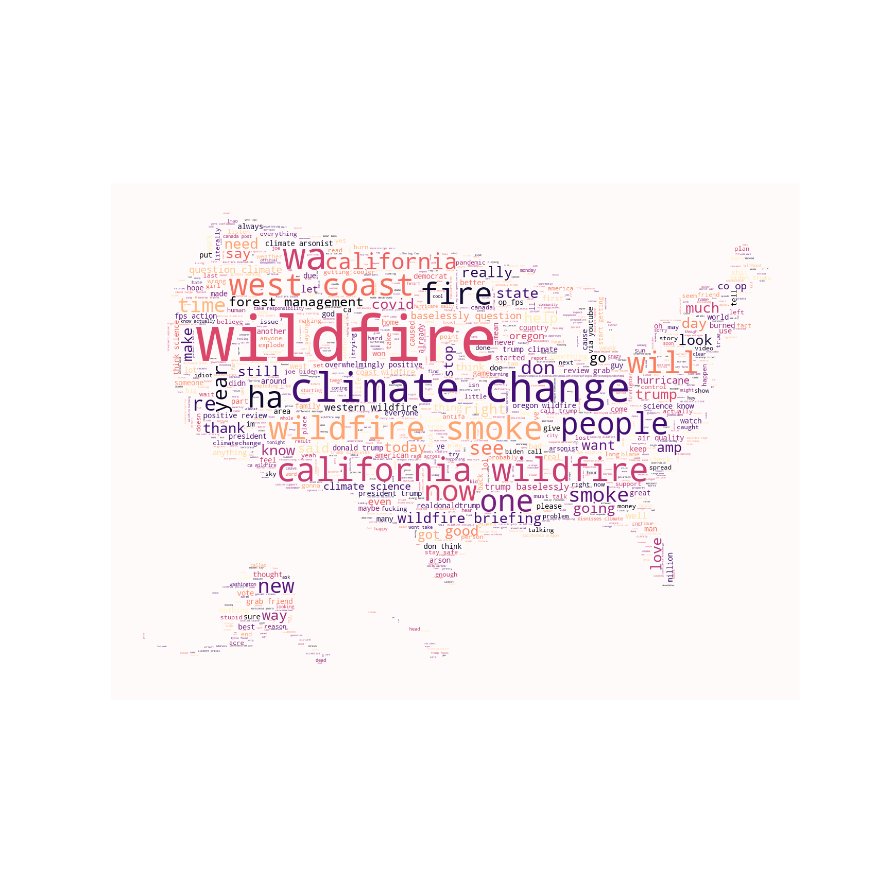
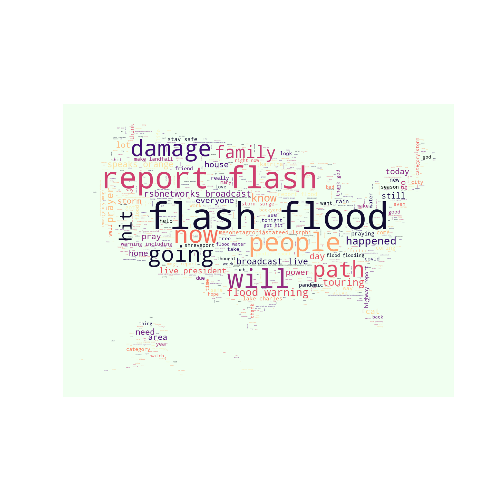
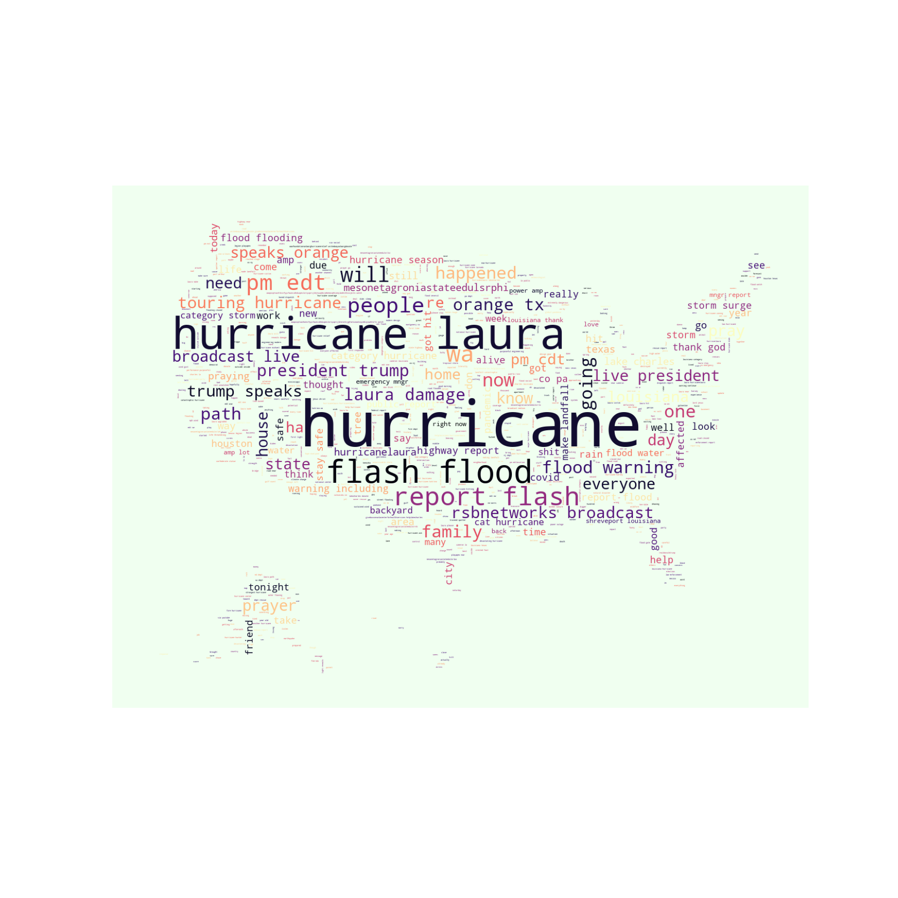

# Leveraging Social Media to Map Natural Disasters

Project by Chris Johnson, Juhee Sung-Schenck, Bob Ding, and Joey Navarro



Photo by [USGS](https://unsplash.com/@usgs?utm_source=unsplash&utm_medium=referral&utm_content=creditCopyText) on [Unsplash](https://unsplash.com/s/photos/natural-disaster?utm_source=unsplash&utm_medium=referral&utm_content=creditCopyText)

## Introduction

- When responding to disasters (e.g. damage and casualties caused by hurricanes, tornadoes, floods, fires etc.), it is critical to map and identify locations of survivors needing assistance.
- Currently, satellite and aerial imagery, ground surveys and modeled hazard data are the primary tools used to assess damage and to identify areas where survivors may need assistance.
- Often, survivors will resort to using social media to call for help or share information about their location and the current situation. In many cases they will also include useful images showing water levels, amount of damage etc. which could indicate on the intensity of the disaster.
- This information can be leveraged to track the event in real-time. Social media can help identify isolated communities at risk, locations of survivors and areas where assistance teams should be sent for search and rescue, levels of damage, help map depths of flooding, identify where additional imagery/information needs to be collected and plan when and where resources should be allocated.

- This project will discover new ways to leverage social media, twitter specifically, to supplement current tools and methodologies used when responding to disasters.
- The tools developed in this project will also help leverage social media to locate hot spots of where people are needing assistance, using, for example, geolocated posts/tweets containing keywords such as "flood", "fire", "damage", "destroyed" or anything else that could be related to the specific disaster event, including searching for images tagged with relevant keywords. A main challenge will be, of course, removing irrelevant information that may happen to contain similar keywords.

## Problem Statement

Tasked with producing an output which would map input from social media users regarding a relevant disaster or emergency thus we decided to create a web app.

Create a user friendly web app that allows users access to natural disaster tweets and their plotted
## Project Goal

- Collect tweet messages data relating to #earthquake, #wildfire, #hurricane Twitter hashtags using Twitter API's

- Find tweet messages from user input keywords and map the location of the disasters

- Use the tweet message data with supervised learning models to train a model that will classify tweets and predicted disasters

- Use the tweet message data with unsupervised learning models that will classify tweets and predict disasters

- Map tweet message data collected in order to:

  - Accurately locate hot spots where poeple are needing assistance.

  - Effectively allocate resource for relief work.

  - Precisely evaluate local damage and economic impace for insurance purposes.


## Modeling

### Supervised Learning Models

Vectorizers Used: CountVectorizer, Tf-idf Vectorizer

Classifiers: Multinomial Naive Bayes, Support Vector Machine

**Support Vector Machine with Tf-idf Vectorizer as final and production model - Accuracy Score: > 89%

### Unsupervised Learning Models

Vectorizers Used: CountVectorizer, Tf-idf Vectorizer, Word2Vec

Classifiers: KMeans, DBScan, Support Vector Machine, Logistic Regression

**Support Vector Machine with Word2Vec as final and production model - Accuracy Score: > 85%

## Flask Application

- Take user input for emergencies
- Look through the tweets and find ones with matching keywords
- Display areas with emergenies on maps using geolocation from tweets

geolocation predicted from supervised or unsupervised machine learning models.

## Project Summary

​	Twitter data was collected relative to several natural disaster events, an earthquake in Utah, hurricanes of the Gulf of Mexico, and wildfires in California. Tweets from the social media platform were gathered using various Python library APIs, including Tweepy, Twint, GetOldTweets, the specific intent being to locate tweets with location information. A hurdle presented itself as it was found that geolocation data cannot be collected due to changes in Twitter's policies. Upon further investigation it was found that in June of 2019, Twitter announced that it was removing the unique location feature from user tweets. With this change, users only share their locations when sharing an image or video directly from the camera on their phone, and purposely selecting to share their precise location. With this new limitation, precise location data could not be gathered for a significant quantity of tweets; thus, artificial geolocation information for the dataset was created.

​	In order to have a working dataset for each event, data from the day of and immediately after a natural disaster event was collected using keywords such as hurricane, wildfire, or earthquake. Data was also collected from dates unrelated to the event in order to add variation to our model. The individually gathered datasets were then compiled into one dataset. The dataset was manipulated in the following ways: 1) a target label feature was created to inform whether the tweet was related to a natural disaster, 2) geolocations were generated, according to where the disaster happened within a given radius since this information was unobtainable.

​	The supervised model for the earthquake event used both Multinomial Bayes and Support Vector Machine models.  Various iterations were tested using both CVEC and TF IDF; ultimately, the best performing model scored 89% accuracy in predicting the earthquake-related tweet. These may include tweets that may not be directly related to an emergency but discuss the event in general; however, we could not make a model generate that determination given the time limitations.
​	Unsupervised models were also tested specifically: KMeans, DBSCAN, with count/
TF-IDF vectorization and logistic/SVC with word2vec. The best model among these was again SVC with word2vec scoring over 85%, respectfully, for all the datasets. To note, this might cover unrelated tweets as well.
​	The ultimate goal of the project is to be able to map an event from social media. A function which randomly assigned locations to the tweet datasets allowd for the ability to plot the dataset so as to give the client to access the information gathered. The Python library Plotly allowed the tweet dataset to be ploted and for the matching of specific keywords plotted on a map. Tweets and their corresponding coordinates locations match the keywords compiled through a function that filter users provided keywords throughout the dataset.

## Project Outcomes

​	A user-friendly web app built using Flask allows the showcasing of the work done. A user, presumably an emergency worker, will input up to 6 keywords to search through tweets' data frame in this simple application. The user can select whether to limit the search to include all of the keywords or any keywords and select which emergency event to search. Once this is submitted, the function is passed, which splits the keywords into a list and filters the data frame based on the user's selections. The final output is a plotly map with the matching tweets, which the user can manipulate by zooming in and out, and hovering over the individual plots of the tweets to display their latitude, longitude, and text.

### Earthquake Top Words

| With Stopwords                                        | Without Stopwords                               |
| ----------------------------------------------------- | ----------------------------------------------- |
|  |  |

### Wildfires Top Words

| With Stopwords                                      | Without Stopwords                             |
| --------------------------------------------------- | --------------------------------------------- |
|  |  |


### Hurricane Top Words

| With Stopwords                                       | Without Stopwords                              |
| ---------------------------------------------------- | ---------------------------------------------- |
|  |  |


## Conclusion

​	Tweets relevant to specific keywords provided by the user can be displayed using a web app. Some things to consider regarding the project. Our supervised model labeled the tweets using a straightforward method of whether the tweet included the word "earthquake" or not. The dataset included less than 40,000 tweets. We did not have access to the actual locations. Given more time and resources, we would like to manually review each tweet and label our training data's relevancy. The largest limitation to this in real-life applications is the inability to access location data. We suggest that the client works with the various social media platforms to persuade them to rethink the location information in an emergency. There are several ways to accomplish this. It could be a large scale PSA campaign encouraging individuals to activate their location information sharing during emergencies. It could be platforms agreeing to "switch-on" location information given a specific event or emergency declaration by government entities.

## Project Directory

```
|--Earthquake
		|--code
				|--01DataCollection-Juhee.ipynb
				|--02DBCreation.ipynb
				|--03DBCleaning.ipynb
				|--04DBFeatureEng.ipynb
				|--05EDA.ipynb
				|--06Modeling.ipynb
				|--06Unsupervised.ipynb
				|--07FinalModel.ipynb
				|--07FinalUnsupervised.ipynb
				|--FuncMap.ipynb
		|--data
				|--cleaned.csv
				|--combined.csv
				|--earthquakes.csv
				|--eq1_loc.csv
				|--eq2_loc.csv
				|--everything.csv
				|--final_labeled.csv
				|--final.csv
				|--non_disaster1.csv
				|--non_disaster2.csv
				|--ridgecrest.csv
				|--whatever.csv
		|--images
				|--auc_roc.png
				|--confusion_matrix.png
				|--roc_curve.png
				|--sentence_count.png
				|--top20_disaster_t.png
				|--top20_disaster.png
				|--top20_nondisaster_t.png
				|--top20_nondisaster.png
				|--top20_tfidf.png
				|--top20.png
				|--usa.jpg
				|--wc_nostop.png
				|--wc_stopwords.png
				|--word_count.png
				|--worldmap.png
|--forrest_fire.jpg
|--Hurricane
		|--code
				|--01HURDataCollection-Joey.ipynb
				|--02HURCoordinateCreation.ipynb
				|--03HURCleaning.ipynb
				|--04HURFeatureEng.ipynb
				|--05HUREDA.ipynb
				|--06HURModeling.ipynb
				|--07HURFinalModel.ipynb
				|--07HURFinalUnsupervised.ipynb
				|--FuncMap.ipynb
		|--data
				|--clean_hurricane.csv
				|--coordinates_florida_hurricane.csv
				|--coordinates_louisiana_hurricane.csv
				|--coordinates_puertorico_hurricane.csv
				|--coordinates_southcarolina_hurricane.csv
				|--coordinates_texas_hurricane.csv
				|--final_hurricane_labeled.csv
				|--florida_hurricane_oldtweets.csv
				|--louisiana_hurricane_oldtweets.csv
				|--puertorico_hurricane_oldtweets.csv
				|--southcarolina_hurricane_oldtweets.csv
				|--texas_hurricane_oldtweets.csv
		|--images
				|--confusion_matrix.png
				|--roc_curve.png
				|--sentence_count.png
				|--top20_cvec.png
				|--top20_disaster_cvec.png
				|--top20_nondisaster_cvec.png
				|--top20_tfidf.png
				|--top20.png
				|--usa.jpg
				|--wc_nostop.png
				|--wc_stopwords.png
				|--word_count.html
				|--word_count.png
		|--vectors
				|--#lexvec.enwiki+newscrawl.300d.W.pos.vectors#
|--README.mn
|--Webapp
		|--app.py
		|--data
				|--sandy2012_labeled_data
		|--final_labeled_earthquake.csv
		|--final_labeled_hurricane.csv
		|--final_labeled_wildfire.csv
		|--flask_map1.html
		|--funcmap.py
		|--templates
				|--about.html
				|--home.html
				|--layout.html
				|--results.html
				|--static
						|--main.css
|--Wildfires
		|--code
				|--01_DataCollection_wildfire.ipynb
				|--02DBCreation_wildfire.ipynb
				|--03DBCleaning_wildfire.ipynb
				|--04DBFeatureEng_wildfire.ipynb
				|--05EDA_wildfire.ipynb
				|--06Modeling_wildfire.ipynb
		|--data
				|--cleaned.csv
				|--final_labeled.csv
				|--final.csv
				|--no_wildfire_new.csv
				|--wildfire_new.csv
		|--google_dirve_link.txt
		|--images
				|--auc_roc.png
				|--confusion_matrix.png
				|--flask_map1.html
				|--sentence_count.html
				|--sentence_count.png
				|--test-fig2.html
				|--top20_disaster_t.png
				|--top20_disaster.png
				|--top20_nondisaster_t.png
				|--top20_nondisaster.png
				|--top20_tfidf.png
				|--top20.png
				|--usa.jpg
				|--wc_nostop.png
				|--wc_stopwords.png
				|--word_count.html
				|--word_count.png
```
